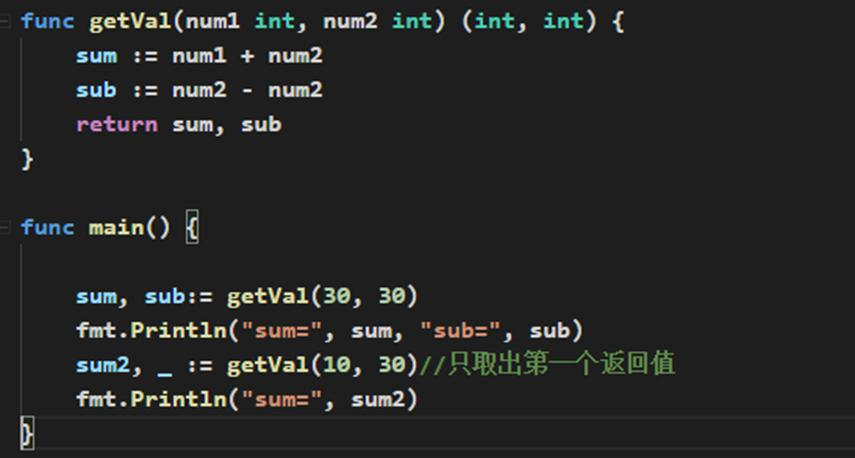

# Golang 变量 

## 为什么需要变量 

1. 一个程序就是一个世界

2. 变量是程序的基本组成单位

   - 不论是使用哪种高级程序语言编写程序,变量都是其程序的基本组成单位，比如一个示意图：

   

   - 比如上图的 sum,sub 都是变量。 

## 变量的介绍

1. 变量的概念 

   变量相当于内存中一个数据存储空间的表示，你可以把变量看做是一个房间的门 

   牌号，通过门牌号我们可以找到房间，同样的道理，通过变量名可以访问到变量 

   (值)。 

2. 变量的使用步骤 

   1) 声明变量(也叫:定义变量) 

   2) 非变量赋值 

   3) 使用变量

