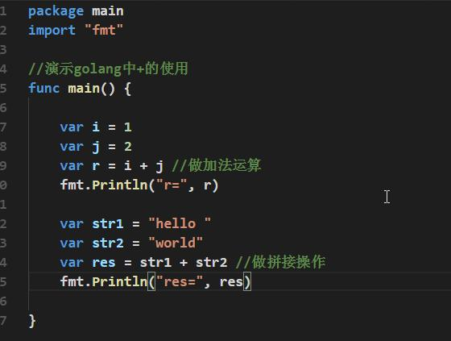
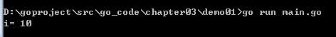
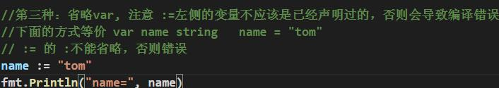
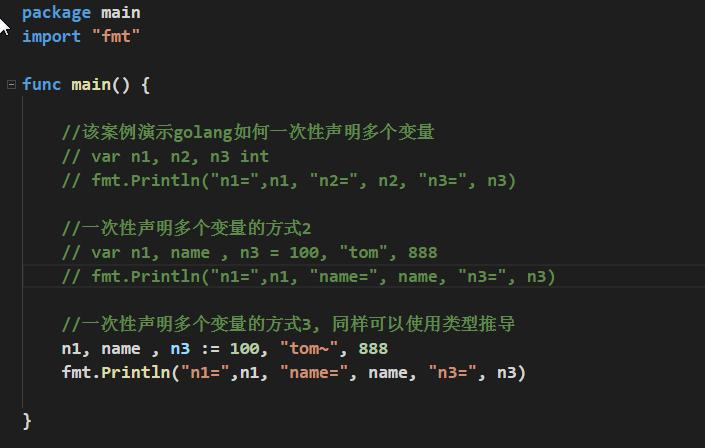
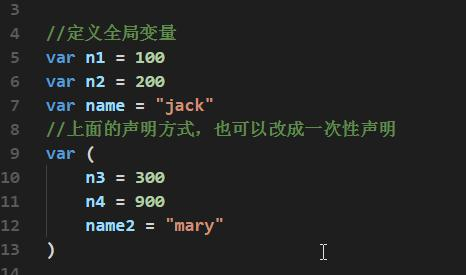
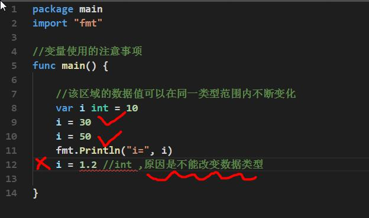
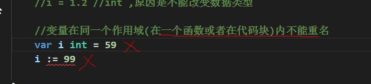

# 变量的声明，初始化和赋值

## 程序中 +号的使用 

1) 当左右两边都是数值型时，则做加法运算 

2) 当左右两边都是字符串，则做字符串拼接 

# 变量案例

输出： 

# 变量使用注意事项

1) 变量表示内存中的一个存储区域 

2) 该区域有自己的名称（变量名）和类型（数据类型） 

示意图： 

3) Golang 变量使用的三种方式

- 第一种：指定变量类型，**声明后若不赋值，使用默认值**

  

- 第二种：根据值自行判定变量类型(**类型推导**) 

  

- 第三种：省略 var, 注意 :=左侧的变量不应该是已经声明过的，否则会导致编译错误

   

4) 多变量声明 

在编程中，有时我们需要一次性声明多个变量，Golang 也提供这样的语法 

举例说明

如何一次性声明多个全局变量【在 go 中函数外部定义变量就是全局变量】： 

5) 该区域的数据值可以在同一类型范围内不断变化(重点)

6) 变量在**同一个作用域**(在一个函数或者在代码块)内不能重名 

7) 变量=**变量名**+**值**+**数据类型**，这一点请大家注意，变量的三要素 

8) Golang 的变量如果没有赋初值，编译器会使用默认值, 比如 int 默认值 0 string 默认值为空串， 

小数默认为 0

