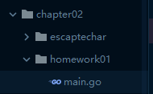
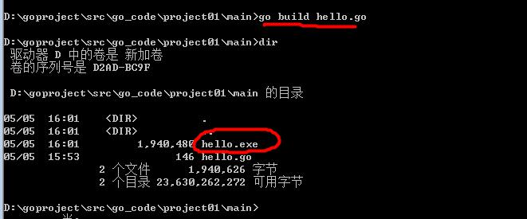
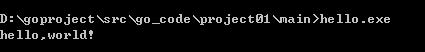
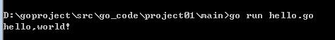
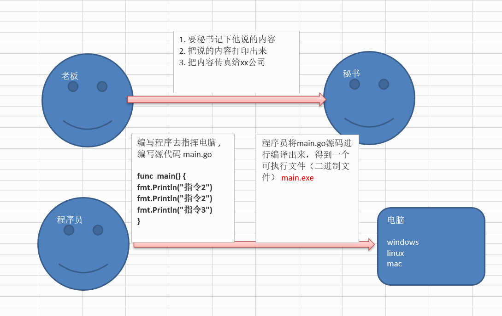

# 1.2 第一个go程序

## 简介： 

Go 语言保证了既能到达**静态编译语言的安全和性能**，又达到了**动态语言开发维护的高效率** 

，使用一个表达式来形容 Go 语言：**Go = C + Python** , 说明 Go 语言既有 C 静态语言程 

序的运行速度，又能达到 Python 动态语言的快速开发。 

1) 从 C 语言中继承了很多理念，包括表达式语法，控制结构，基础数据类型，调用参数传值，**指针**等 

等，也保留了和 C 语言一样的编译执行方式及弱化的指针 

举一个案例(体验)： 

//go 语言的指针的使用特点(体验) 

func testPtr(num *int) { 

*num = 20 

} 

2) 引入**包的概念**，用于组织程序结构，**Go** **语言的一个文件都要归属于一个包**，而不能单独存在。

3) 垃圾回收机制，内存自动回收，不需开发人员管理 

4) 天然并发 (**重要特点**) 

(1) 从语言层面支持并发，实现简单 

(2) goroutine，轻量级线程，可实现大并发处理，高效利用多核。 

(3) 基于 CPS 并发模型(Communicating Sequential Processes )实现 

5) 吸收了管道通信机制，形成 Go 语言特有的管道 channel 通过管道 channel , 可以实现不同的 goroute 

之间的相互通信。 

6) 函数可以返回多个值。举例： 

**//****写一个函数，实现同时返回 和，差** 

**//go** **函数支持返回多个值** 

**func getSumAndSub(n1 int, n2 int) (int, int ) {** 

**sum := n1 + n2 //go** **语句后面不要带分号****.** 

**sub := n1 - n2** 

**return sum , sub** 

**}** 

7) 新的创新：比如切片 slice、延时执行 defer

## 使用Goland编写第一个go程序

[安装go环境](README.md)

- 打开Goland进行新建一个项目

- 目录结构为

  
  
  (1) go 文件的后缀是 .go 
  
  (2) package main 
  
  表示该 hello.go 文件所在的包是 main, 在 go 中，每个文件都必须归属于一个包。 
  
  (3) import “fmt” 
  
  表示：引入一个包，包名 fmt, 引入该包后，就可以使用 fmt 包的函数，比如：fmt.Println 
  
  (4) **func** main() { 
  
  }
  
  func 是一个关键字，表示一个函数。 
  
  main 是函数名，是一个主函数，即我们程序的入口。 
  
  (5) fmt.Println(“hello”) 
  
  表示调用 fmt 包的函数 Println 输出 “hello,world”
  
  

## 编写一个程序，输出"hello,Golang"

```go
package main
import "fmt"

func main() {
	fmt.Println("hello,Golang")
}
```

通过 go build 命令对该 go 文件进行编译，生成 .exe 文件. 



1) 运行 hello.exe 文件即可 



2) 注意：通过 go run 命令**可以**直接运行 hello.go 程序 [类似执行一个脚本文件的形式]



```go
package main // 包名称 也就是你最后一个目录（包）的名称
import "fmt" // 导入所用的包

// main 指的是函数名称 也是程序入口
func main() {
   fmt.Print("Hello Word")   // 正常输出
   fmt.Println("Hello Word") // 输出一次一行
}

// 执行命令 go run 文件名.go 一般用于调试
// 执行命令 go build 文件名.go 会输出一个 .exe文件
// 执行命令 go build 文件名.go 会输出一个 .exe文件
```

## 直接 go run 来运行

```go
go run
```

如果是对源码编译后，再执行，Go 的执行流程如下图 


如果我们是对源码直接 执行 go run 源码，Go 的执行流程如下图


## 两种执行流程的方式区别 

1) 如果我们先编译生成了可执行文件，那么我们可以将该可执行文件拷贝到没有 go 开发环境的机 

器上，仍然可以运行 

2) 如果我们是直接 go run go 源代码，那么如果要在另外一个机器上这么运行，也需要 go 开发 

环境，否则无法执行。 

3) 在编译时，编译器会将程序运行依赖的库文件包含在可执行文件中，所以，可执行文件变大了 

很多。

## Go 程序开发的注意事项 

1) Go 源文件以 "go" 为扩展名。 

2) Go 应用程序的执行入口是 main()函数。 这个是和其它编程语言（比如 java/c） 

3) Go 语言严格区分大小写。 

4) Go 方法由一条条语句构成，**每个语句后不需要分号**(Go 语言会在每行后自动加分号)，这也体尚硅谷 Go 语言课程 

更多 Java –大数据 –前端 –python 人工智能 -区块链资料下载，可访问百度：尚硅谷官网 

第 29页 

现出 Golang 的简洁性。 

5) Go 编译器是一行行进行编译的，因此我们一行就写一条语句，不能把多条语句写在同一个，否 

则报错


6) go 语言**定义的变量**或者 **import** **的包**如果没有使用到，代码不能编译通过。 


7) 大括号都是成对出现的，缺一不可。

## 编译命令

```yacas
E:\go\代码\Project\基础\hello_word\main>go run hello_word.go
Hello WordHello Word
Hello Word

E:\go\代码\Project\基础\hello_word\main>go build

E:\go\代码\Project\基础\hello_word\main>dir
驱动器 E 中的卷是 study
卷的序列号是 DCA4-4E82

E:\go\代码\Project\基础\hello_word\main 的目录

2021/05/31  23:10    <DIR>          .
2021/05/31  23:10    <DIR>          ..
2021/05/31  23:09               480 hello_word.go
2021/05/31  23:10         2,144,256 main.exe
2 个文件      2,144,736 字节
2 个目录 108,196,679,680 可用字节

E:\go\代码\Project\基础\hello_word\main>go build hello_word.go

E:\go\代码\Project\基础\hello_word\main>dir
驱动器 E 中的卷是 study
卷的序列号是 DCA4-4E82

E:\go\代码\Project\基础\hello_word\main 的目录

2021/05/31  23:10    <DIR>          .
2021/05/31  23:10    <DIR>          ..
2021/05/31  23:10         2,144,256 hello_word.exe
2021/05/31  23:09               480 hello_word.go
2021/05/31  23:10         2,144,256 main.exe
3 个文件      4,288,992 字节
2 个目录 108,194,533,376 可用字节

E:\go\代码\Project\基础\hello_word\main>go build -o hello hello_word.go

E:\go\代码\Project\基础\hello_word\main>dir
驱动器 E 中的卷是 study
卷的序列号是 DCA4-4E82

E:\go\代码\Project\基础\hello_word\main 的目录

2021/05/31  23:11    <DIR>          .
2021/05/31  23:11    <DIR>          ..
2021/05/31  23:11         2,144,256 hello
2021/05/31  23:10         2,144,256 hello_word.exe
2021/05/31  23:09               480 hello_word.go
2021/05/31  23:10         2,144,256 main.exe
4 个文件      6,433,248 字节
2 个目录 108,192,387,072 可用字节
```

## 运行程序流程



